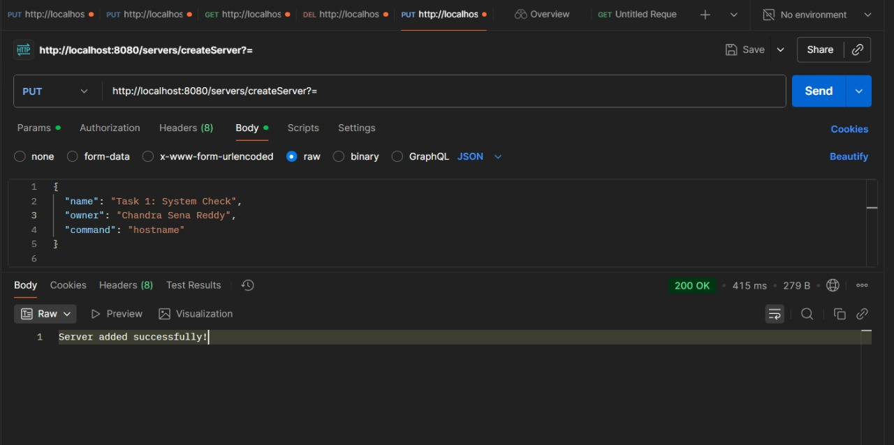
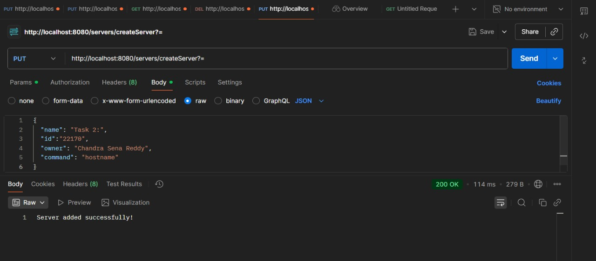
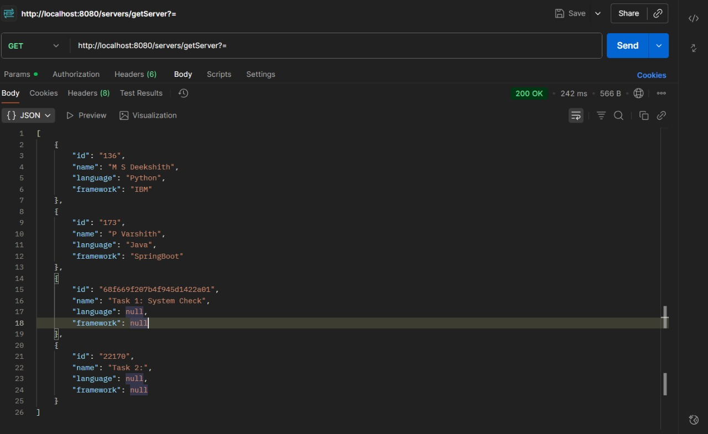
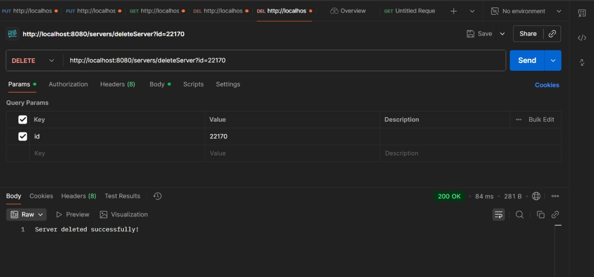

# 🚀 Task 1 - Server Management App

[](https://www.java.com/)
[](https://spring.io/projects/spring-boot)
[](https://www.mongodb.com/)
[](https://www.docker.com/)
  

---

## 🛠 Prerequisites

Before running the app, ensure you have:

- Java
- Maven
- Spring Boot
- MongoDB
- Docker

---

## 📦 Dependencies

- `spring-boot-starter-web`
- `spring-boot-starter-data-mongodb`
- `spring-boot-maven-plugin`

---

## ▶️ Running the Application


1. Open `/task1` in your preferred IDE (VS Code).  
2. Wait for dependencies and pre-build tasks to finish.  
3. Build the project:

```bash
mvn clean install
```

## 🐳 Docker Setup

`Dockerfile` example:

```dockerfile
FROM openjdk:8-alpine
EXPOSE 8080
ADD target/demo.jar demo.jar
ENTRYPOINT ["java", "-Dspring.data.mongodb.uri=mongodb://mongod:27017/servers", "-jar", "/demo.jar"]
```

## 🧪 Testing the APIs

### Postman

Import and run this collection to test all endpoints:

[](https://app.getpostman.com/run-collection/5ff40fbad3968a1b28b0)

> Works with `http://127.0.0.1:8080/servers/`.

### Web UI Forms

> Instructions for using the web interface are in **Task 3**.

### Screenshots





